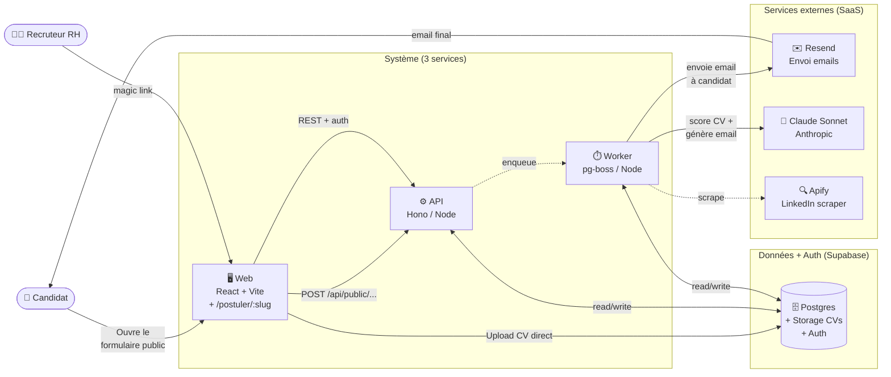
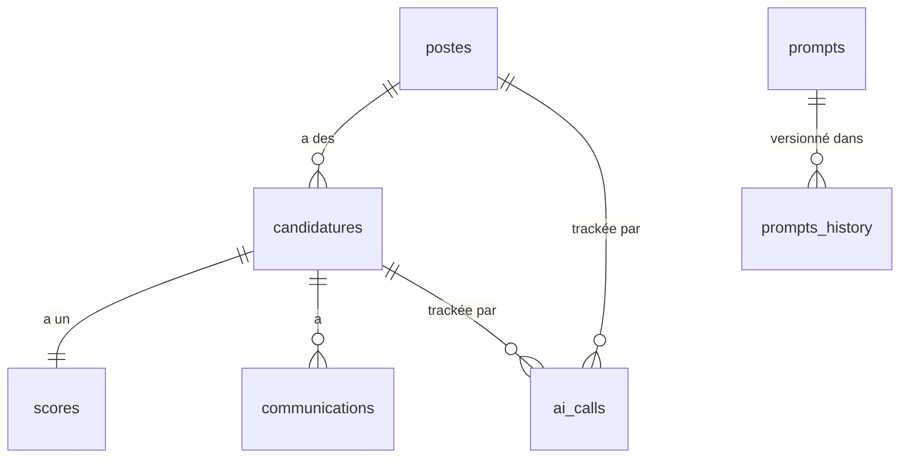
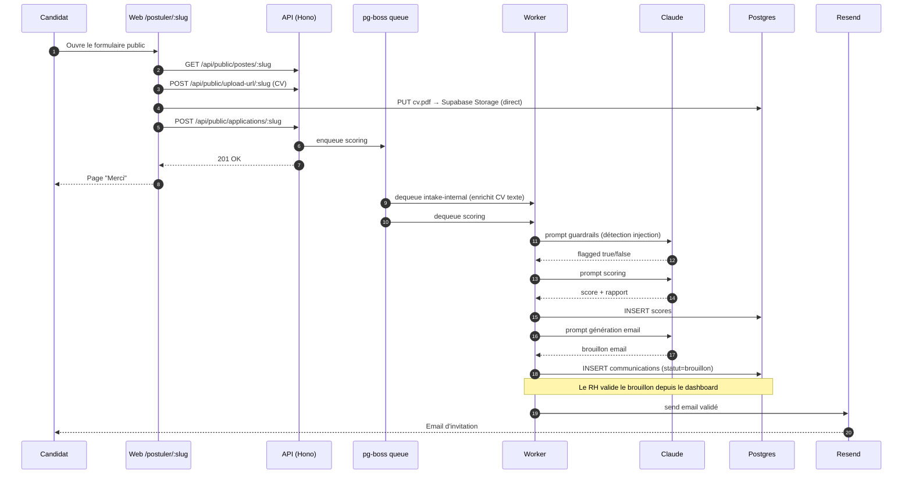
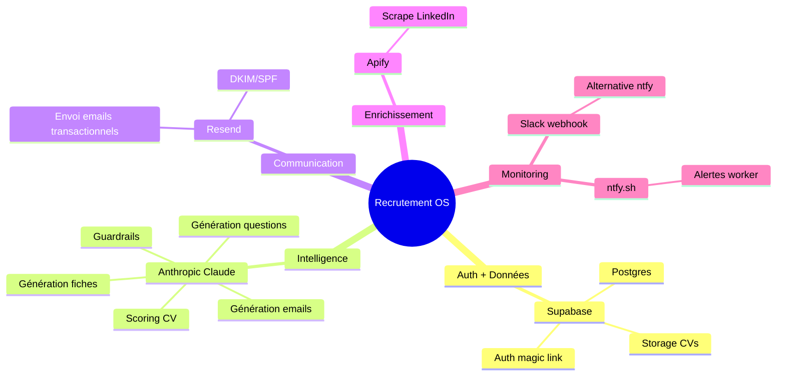
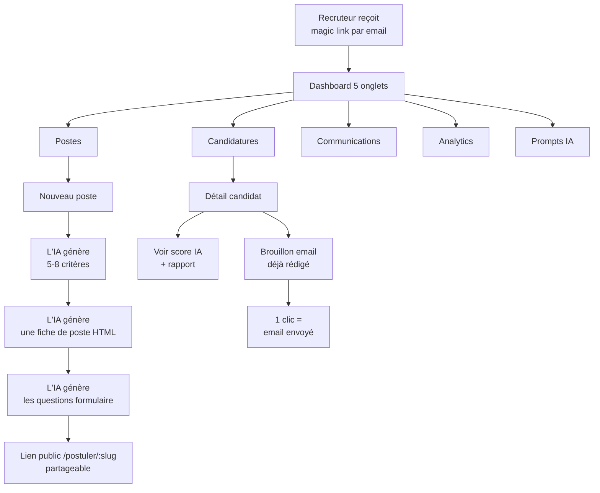

# Architecture du système

> Tu lis ça pour comprendre comment les morceaux s'assemblent. Si tu cherches juste "à quoi ça sert", reviens à [vue-d-ensemble.md](vue-d-ensemble.md).

## Vue d'ensemble en 1 schéma

3 services applicatifs (web, api, worker), une base Supabase, 3 SaaS externes. Tout est lié par des **événements** : la soumission du formulaire public déclenche un job, qui enchaîne des appels Claude, qui finit par un email Resend.

---

## Les 3 services applicatifs

Tous écrits en **TypeScript**, déployés via Docker. Chacun est isolé : il peut crasher sans entraîner les autres.

### `web` — interface du recruteur + formulaire public candidat

- **Stack** : React 19 + Vite + react-router-dom + TanStack Query + Tailwind
- **Routes dashboard** : accessibles uniquement après magic-link Supabase. 5 onglets (Postes, Candidatures, Communications, Analytics, Prompts IA).
- **Route publique** : `/postuler/:slug` — page de candidature sans auth, servie à tous.
- **Authentification** : Supabase Auth, JWT envoyé en `Authorization: Bearer <token>` à l'API. Aucune session côté serveur web.
- **Pas de SSR** : SPA pure servie par nginx.

### `api` — REST backend

- **Stack** : Hono sur Node.js, Drizzle ORM, Zod
- **Rôle** : 30+ endpoints REST. CRUD postes/candidatures/communications, génération synchrone (fiche de poste, email, critères, formulaire), enqueue de jobs asynchrones.
- **Routes publiques** : `GET /api/public/postes/:slug`, `POST /api/public/applications/:slug`, `POST /api/public/upload-url/:slug` — sans auth, avec rate-limiting.
- **Authentification** : middleware qui vérifie le JWT Supabase via JWKS (ES256). CORS configuré pour le domaine web.
- **Persistence** : connexion directe à Postgres Supabase via Drizzle. Pas de cache.

### `worker` — exécuteur de jobs

- **Stack** : pg-boss v10 (file d'attente sur Postgres), Node.js
- **Rôle** : 4 queues (`intake-internal`, `scoring`, `communication`, `heartbeat`). Reçoit des jobs depuis l'API ou via le scheduler interne (cron pg-boss), les exécute, retry automatique sur échec.
- **Particularité** : pg-boss utilise Postgres lui-même comme broker → zéro infrastructure additionnelle (pas de Redis).

### Pourquoi 3 services et pas 1 monolithe ?

- **Isoler les failures** : si Claude est down, le worker accumule des jobs en attente, mais l'API et le web continuent de servir le dashboard.
- **Scaler indépendamment** : un burst de candidatures ne charge pas le web ; on multiplie les workers sans toucher à l'API.
- **Déploiement séparé** : on peut redéployer le worker sans interrompre les utilisateurs RH connectés.

---

## La base de données (Supabase)

Une seule instance Postgres hébergée par Supabase. Schéma piloté par Drizzle.

### Tables principales

| Table | Rôle |
|---|---|
| `postes` | Les offres de recrutement (titre, description, critères, fiche HTML, slug, questions_json) |
| `candidatures` | Les candidats reçus (nom, email, CV, statut, notes RH) |
| `scores` | Une ligne par candidature : score IA + détails par critère + rapport markdown généré |
| `communications` | Brouillons et emails envoyés (sujet, contenu, statut, lien réservation intégré) |
| `prompts` | Les 6 prompts IA en BD (éditables depuis l'UI, sans redéploiement) |
| `prompts_history` | Historique de toutes les versions de chaque prompt |
| `ai_calls` | Log de chaque appel Claude (tokens, coût EUR, type de prompt) |

### Schéma simplifié

Détail complet du modèle : [99-reference/modele-de-donnees.md](../99-reference/modele-de-donnees.md).

### Authentification + Storage

Supabase apporte 3 services en un :
- **Postgres** pour les données métier
- **Auth** pour les magic links recruteur (table `auth.users` séparée)
- **Storage** pour héberger les CVs uploadés via le formulaire public (bucket `cvs`)

---

## Pipeline d'une candidature (vue technique)

7 étapes principales, chacune indépendante et retry-able. Si Claude échoue à l'étape scoring, le worker retry 3 fois ; après échec final, une notification alerte le RH dans le dashboard.

Détails par flow : [pipeline-candidat.md](pipeline-candidat.md).

---

## Les services externes utilisés

Le système s'appuie sur 4 SaaS, chacun jouant un rôle précis.

Tous ces services peuvent être **swap** par d'autres équivalents. Voir [04-personnaliser/integrations.md](../04-personnaliser/integrations.md).

---

## Ce qui se passe quand un recruteur utilise l'app

Le recruteur n'écrit quasiment rien : il valide ce que l'IA a déjà préparé.

---

## Conventions techniques importantes

Pour que tu (ou ton agent IA) ne sois pas surpris :

- **Workspace TS via tsx** : les packages `packages/*` exportent du TypeScript source, pas du `dist/`. En prod, on lance les apps avec `node --import tsx src/index.ts`.
- **CORS avant auth** : dans Hono, l'ordre des middlewares compte. CORS doit s'exécuter avant le check auth, sinon les preflights OPTIONS sont rejetés en 401.
- **pg-boss v10** : il faut appeler `boss.createQueue(name)` avant tout `send()` ou `work()`, sinon `send()` retourne `null` silencieusement.
- **Routes publiques** : montées AVANT le middleware auth dans `apps/api/src/routes/index.ts`. Ne jamais mettre une route publique derrière `app.use("/api/*", auth)`.
- **Radix Select** : `<SelectItem value="">` est interdit (utiliser un sentinel `"__none__"`).

Liste exhaustive des conventions : [AGENTS.md](../../AGENTS.md) à la racine du repo.

---

## Pour aller plus loin

- **Le détail du pipeline** : [pipeline-candidat.md](pipeline-candidat.md)
- **Pourquoi avoir choisi cette stack** : [pourquoi-ces-choix.md](pourquoi-ces-choix.md)
- **Le modèle de données complet** : [../99-reference/modele-de-donnees.md](../99-reference/modele-de-donnees.md)
- **Les endpoints API disponibles** : [../99-reference/api-endpoints.md](../99-reference/api-endpoints.md)
