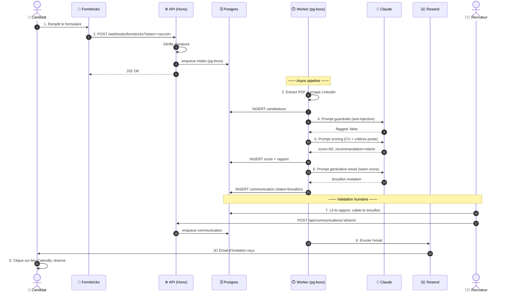

# Pipeline candidat — bout en bout

Walkthrough détaillé de ce qui se passe quand un candidat soumet sa candidature, étape par étape, avec les fichiers de code impliqués et les points de friction connus.

## Vue rapide en 1 schéma



Les 8 étapes sont détaillées ci-dessous, avec les fichiers de code impliqués.

---

## Étape 1 — Soumission Formbricks

Le candidat remplit le formulaire sur l'URL Formbricks publique (`https://your-formbricks-domain/s/<survey-id>`). Les questions standard (nom, email, téléphone, LinkedIn, CV) sont définies en dur dans `apps/api/src/services/formbricks.ts` (`STANDARD_QUESTIONS`). Les questions IA-générées sont créées par `runFormulairePrompt()` quand le RH clique "Créer le formulaire" sur un nouveau poste.

Le `cv_upload` est un champ texte qui demande **une URL PDF accessible publiquement** (Drive partagé, Dropbox, etc.) — ce n'est **pas** un upload de fichier. Voir [04-personnaliser/integrations.md](../04-personnaliser/integrations.md#hosting-cv) pour les alternatives.

## Étape 2 — Webhook Formbricks → API

Quand le candidat valide, Formbricks fire un webhook sur :
```
POST https://api.your-domain.example/webhooks/formbricks?token=<secret>
```

Le token query-param est validé par `apps/api/src/routes/webhooks/formbricks.ts`. Si `FORMBRICKS_WEBHOOK_SECRET` est défini, requêtes non-signées → 401.

Une fois validée, la requête appelle `enqueueIntake(payload)` qui pousse un job dans la queue pg-boss `intake`. Réponse : `202 { ok: true, job_id: "..." }`.

## Étape 3 — Worker intake (`apps/jobs/src/handlers/intake.ts`)

Le worker poll la queue, récupère le job, et :

1. Extrait `nom`, `email`, `téléphone`, `cv_upload`, `linkedin_url` du payload (clés tolérantes : `nom|name|fullName|...`)
2. Match `data.surveyId` avec un poste qui a `formbricks_survey_id` correspondant en BD. Sinon → erreur "Aucun poste pour surveyId=…"
3. Télécharge le PDF via `extractPdfText()` (`apps/jobs/src/services/pdf.ts`) — utilise unpdf, vérifie le content-type
4. Scrape le LinkedIn via `scrapeLinkedin()` (`apps/jobs/src/services/linkedin.ts`) — utilise Apify si `APIFY_API_KEY` configuré, sinon retourne null
5. Insère une nouvelle ligne dans `candidatures` (statut `nouveau`)
6. Enqueue un job `scoring` pour cette candidature

**Gotcha** : si le PDF n'est pas accessible (404, mauvais content-type), `extractPdfText` retourne null et la candidature est créée avec `cv_texte_extrait: null`. Le scoring continuera mais avec un input incomplet → score forcément plus bas.

## Étape 4 — Worker scoring (`apps/jobs/src/handlers/scoring.ts`)

1. Met à jour la candidature en `en_analyse`
2. Charge le poste + ses critères (`postes.criteres_scoring`, JSON)
3. Appel **guardrails** : `runGuardrails()` analyse le CV + réponses pour détecter une injection de prompt (patterns "ignore previous", "you are now", balises `[SYSTEM]`, etc.). Si flagged, set `flagged=true` et `flag_motif`.
4. Appel **scoring** : `runScoringPrompt()` (Claude Sonnet, tool use) note chaque critère sur 100 et génère un `rapport_ia` en français + une `recommandation` (`retenir`/`a_voir`/`refuser`)
5. Insère/upsert dans `scores` (clé unique sur `candidature_id`)
6. Met à jour la candidature en `score`
7. Enqueue un job `communication` (type `invitation` ou `refus` selon recommandation) — sauf si `flagged=true` (RH décide manuellement)

Le coût Claude est tracé dans `ai_calls` après chaque appel. Voir [05-operer/monitoring.md](../05-operer/monitoring.md).

## Étape 5 — Worker communication (`apps/jobs/src/handlers/communication.ts`)

1. Charge la candidature, le poste, le score, et le `calendly_event_type` du poste si applicable
2. Si invitation et Calendly configuré : `createSchedulingLink()` génère un lien unique pour le candidat
3. `runEmailPrompt()` (Claude Sonnet, tool use) génère sujet + contenu de l'email selon le type (`invitation`/`refus`/`relance`)
4. Insère dans `communications` avec `statut: brouillon`

À ce stade, **rien n'est encore envoyé**. Le RH voit le brouillon dans le dashboard et peut éditer.

## Étape 6 — Validation RH + envoi

Dans `https://rh.your-domain.example/candidatures/:id` :
- RH revoit le score, le rapport IA, les réponses
- Édite optionnellement le brouillon d'email (sujet, contenu)
- 4 boutons disponibles selon la configuration :

**Flux par défaut (sans Resend)** :
- **Copier** → copie sujet + contenu dans le presse-papier
- **Ouvrir dans mon mail** → ouvre Gmail/Outlook via `mailto:` avec sujet + corps pré-remplis
- **Marquer comme envoyé** → `POST /api/communications/:id/mark-sent` → statut `marque_envoye`

**Flux avec Resend (optionnel, si `RESEND_API_KEY` configuré)** :
- **Envoyer via Resend** → `POST /api/communications/:id/send` → statut `valide` → enqueue job → worker appelle `sendEmail()` → statut `envoye`

En cas d'échec Resend (TLD invalide, quota, etc.), statut → `erreur` + notif ntfy.

## Étape 7 — Candidat reçoit + clique Calendly

Le candidat ouvre l'email, clique le lien Calendly, choisit un créneau. Calendly notifie l'organisateur par email (pas d'intégration backend dans la version actuelle — le RH gère les confirmations dans Google Calendar).

## Points d'extension

- **Ajouter une étape** (ex: scraping additionnel, vérification d'identité) → `apps/jobs/src/handlers/` + nouvelle queue pg-boss
- **Changer le scoring** → édite le prompt `Scoring candidat` directement dans le dashboard `/prompts` (pas besoin de redeploy)
- **Changer le ton des emails** → édite `Génération email` dans `/prompts`
- **Ajouter un type d'email** (ex: relance après 7 jours sans réponse) → étendre le `enum` `CommunicationTypeSchema` + ajouter un trigger côté worker

Voir [04-personnaliser/](../04-personnaliser/) pour des recettes détaillées.
