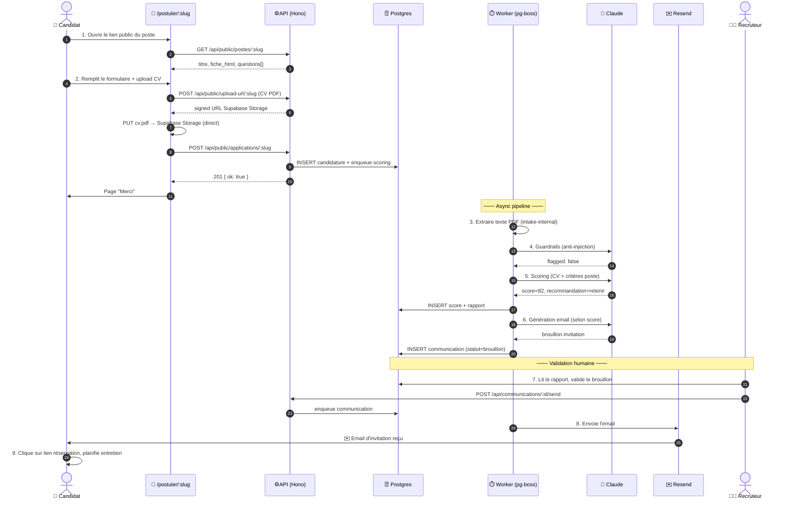

# Pipeline candidat — bout en bout

Walkthrough détaillé de ce qui se passe quand un candidat soumet sa candidature, étape par étape, avec les fichiers de code impliqués et les points de friction connus.

## Vue rapide en 1 schéma

Les étapes sont détaillées ci-dessous.

---

## Étape 1 — Formulaire public `/postuler/:slug`

Le candidat reçoit le lien `https://rh.your-domain.example/postuler/<slug>` depuis le recruteur.

La page charge via `GET /api/public/postes/:slug` (endpoint public, sans auth) :
- Le titre et la description du poste (ou la fiche HTML générée)
- La liste des questions (`questions_json`) : 5 questions standard + questions IA-générées par critère

Les questions standard sont définies dans `packages/types/src/domain.ts` (`STANDARD_QUESTIONS`) :
- `nom` (text, requis)
- `email` (email, requis)
- `telephone` (tel, optionnel)
- `linkedin_url` (url, optionnel)
- `cv_pdf` (file_pdf, requis)

Les questions IA-générées sont créées par `runFormulairePrompt()` quand le RH clique "Régénérer les questions" dans le dashboard (`POST /api/postes/:id/generate-questions`).

## Étape 2 — Soumission et upload CV

Le candidat remplit le formulaire dans son navigateur (composant React `ApplicationForm`).

**Upload du CV (2 étapes)** :
1. Le frontend appelle `POST /api/public/upload-url/:slug` → reçoit une URL signée Supabase Storage
2. Upload direct `PUT <signed-url>` du PDF (max 5 MB) — bypass l'API, va directement dans le bucket `cvs`
3. Le frontend stocke l'URL publique du fichier dans `reponses.cv_pdf`

**Anti-bot** : un champ honeypot `website_url` caché est inclus. Si rempli par un bot, le serveur retourne `{ ok: false }` sans créer de candidature.

**Soumission** : `POST /api/public/applications/:slug` avec `{ website_url, reponses }`.
- Rate-limit : 5 requêtes / 15 minutes / IP
- Validation côté serveur : champs requis, format email, format URL

La candidature est insérée dans `candidatures` et un job `scoring` est enqueued dans pg-boss.

## Étape 3 — Worker intake-internal (`apps/jobs/src/handlers/intake-internal.ts`)

Handler léger qui enrichit la candidature avec le texte du CV :

1. Reçoit `{ candidature_id }` depuis la queue `intake-internal`
2. Télécharge le PDF depuis Supabase Storage via `extractPdfText()` (`apps/jobs/src/services/pdf.ts`)
3. Met à jour `cv_texte_extrait` sur la candidature

Note : le scoring est déjà enqueued par l'API. Ce handler enrichit seulement le contenu avant que le scoring s'exécute.

**Gotcha** : si le PDF n'est pas accessible (404, mauvais content-type), `extractPdfText` retourne null et la candidature est scorée avec `cv_texte_extrait: null`. Le scoring continue avec un input incomplet → score potentiellement plus bas.

## Étape 4 — Worker scoring (`apps/jobs/src/handlers/scoring.ts`)

1. Met à jour la candidature en `en_analyse`
2. Charge le poste + ses critères (`postes.criteres_scoring`, JSON)
3. Appel **guardrails** : `runGuardrails()` analyse le CV + réponses pour détecter une injection de prompt (patterns "ignore previous", "you are now", balises `[SYSTEM]`, etc.). Si flagged, set `flagged=true` et `flag_motif`.
4. Appel **scoring** : `runScoringPrompt()` (Claude Sonnet, tool use) note chaque critère sur 100 et génère un `rapport_ia` en français + une `recommandation` (`retenir`/`a_voir`/`refuser`)
5. Insère/upsert dans `scores` (clé unique sur `candidature_id`)
6. Met à jour la candidature en `score`
7. Enqueue un job `communication` (type `invitation` ou `refus` selon recommandation) — sauf si `flagged=true` (RH décide manuellement)

Le coût Claude est tracé dans `ai_calls` après chaque appel. Voir [05-operer/monitoring.md](../05-operer/monitoring.md).

## Étape 5 — Worker communication (`apps/jobs/src/handlers/communication.ts`)

1. Charge la candidature, le poste, le score, et le `lien_reservation_url` du poste si applicable
2. `runEmailPrompt()` (Claude Sonnet, tool use) génère sujet + contenu de l'email selon le type (`invitation`/`refus`/`relance`)
3. Insère dans `communications` avec `statut: brouillon`

À ce stade, **rien n'est encore envoyé**. Le RH voit le brouillon dans le dashboard et peut éditer.

## Étape 6 — Validation RH + envoi

Dans `https://rh.your-domain.example/candidatures/:id` :
- RH revoit le score, le rapport IA, les réponses
- Édite optionnellement le brouillon d'email (sujet, contenu)
- 4 boutons disponibles selon la configuration :

**Flux par défaut (sans Resend)** :
- **Copier** → copie sujet + contenu dans le presse-papier
- **Ouvrir dans mon mail** → ouvre Gmail/Outlook via `mailto:` avec sujet + corps pré-remplis
- **Marquer comme envoyé** → `POST /api/communications/:id/mark-sent` → statut `marque_envoye`

**Flux avec Resend (optionnel, si `RESEND_API_KEY` configuré)** :
- **Envoyer via Resend** → `POST /api/communications/:id/send` → statut `valide` → enqueue job → worker appelle `sendEmail()` → statut `envoye`

En cas d'échec Resend (TLD invalide, quota, etc.), statut → `erreur` + notif ntfy.

## Étape 7 — Candidat reçoit + réserve un entretien

Le candidat ouvre l'email, clique le lien de réservation (`lien_reservation_url` du poste : Calendly, Cal.com, ou autre). Le RH gère les confirmations dans son agenda.

## Points d'extension

- **Ajouter une étape** (ex: scraping additionnel, vérification d'identité) → `apps/jobs/src/handlers/` + nouvelle queue pg-boss
- **Changer le scoring** → édite le prompt `Scoring candidat` directement dans le dashboard `/prompts` (pas besoin de redeploy)
- **Changer le ton des emails** → édite `Génération email` dans `/prompts`
- **Ajouter un type d'email** (ex: relance après 7 jours sans réponse) → étendre le `enum` `CommunicationTypeSchema` + ajouter un trigger côté worker

Voir [04-personnaliser/](../04-personnaliser/) pour des recettes détaillées.
